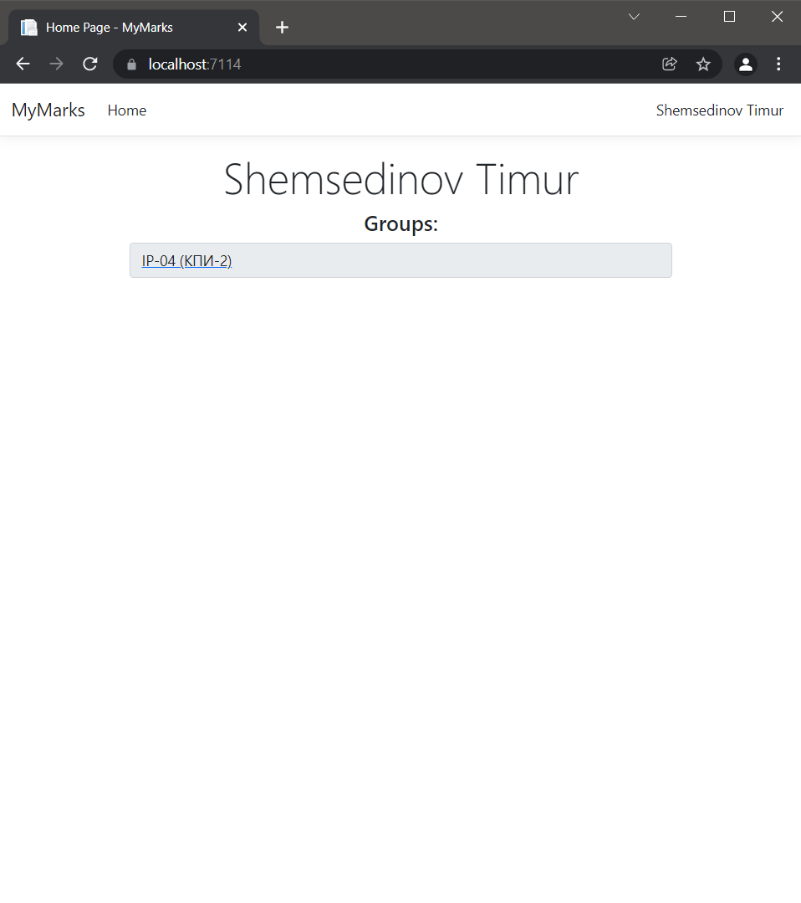
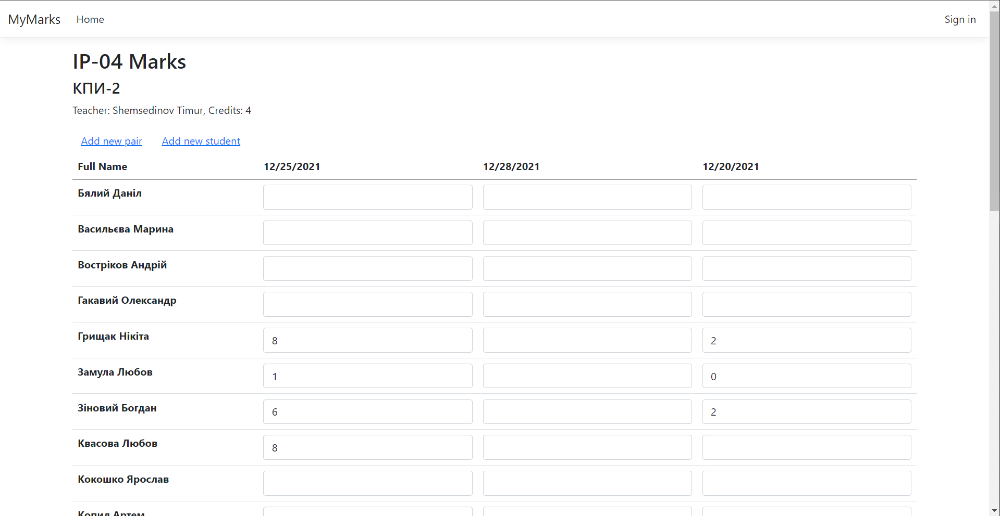
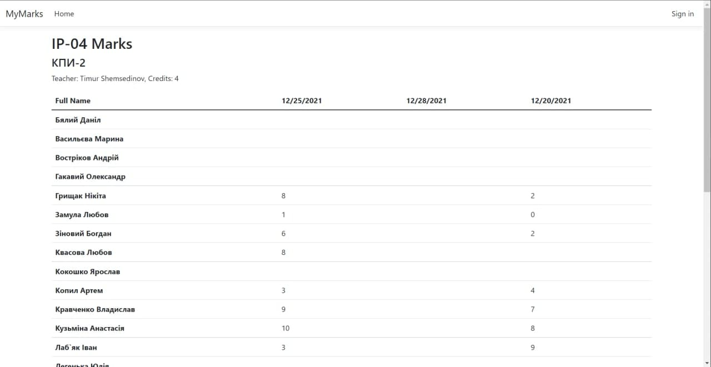
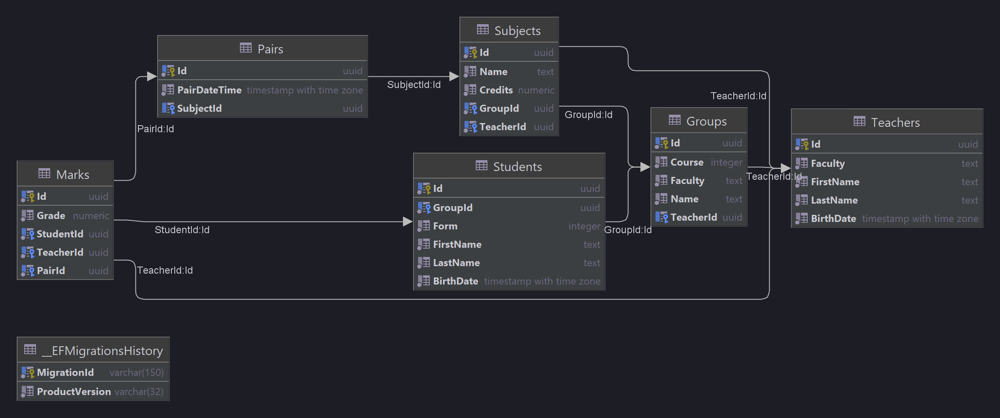

# MyMarks management system

## Concept Idea

This is a system that allows storing groups of students and their marks. This can be useful for groups headmasters and
teachers to track students' progress.

## Architecture

This project was created with classic layered architecture. MyMarks MS contains three logical layers: UI Level (Razor
Pages), Business Logic layer (ASP.NET MVC Web APP & REST API) and DAL (Entity Framework Core)
### UI Layer

This layer implements UI features base using Razor Pages. This tech use stateless SSR rendering and MVC sub-layer as a
backend tech.

All UI Pages use [`DIBasePageModel`](https://github.com/Avaztazia/MyMarks/blob/master/MyMarks/Contracts/DIBasePageModel.cs) this base page gives a database context and an auth provider.

#### Screenshots

Main page


Marks page for teacher (with editable mark fields)


Marks page for group (without editable mask fields)


### BL Layer

This layer represents API controllers that implement some data retrieving and saving logic throw DAL.
REST API Controllers are located at [`ApiControllers`](https://github.com/Avaztazia/MyMarks/tree/master/MyMarks/ApiControllers) folder.

### Data Access Layer
This layer is implemented with EF Core and Repository Design Pattern that allows to reduce a code base size and follow KISS and DRY principles.

#### Data base schema


## Development

### Requirements
- NET 6 SDK, ASP.NET 6
- Entity Framework Core 6 and related packages for Code-First Approach
- IDE for C#(.NET). Rider(preferred) or Visual Studio 2019+
- PostgreSQL Server 12+

### Configuring

Override [`application.json`](https://github.com/Avaztazia/MyMarks/blob/master/MyMarks/appsettings.json) with your values:
```json
"ConnectionStrings": {
  "MyMarksDb": "LOCAL_DB_CONNECTION_STRING"
}
```

### Creating DB schema
To Create DB schema use `dotnet-ef` console tool.
```
dotnet ef database update
```

## Authors
Kuzmina Anastasia — [@avaztazia](www.t.me/avaztazia)

## Contributing
If you have any ideas for improving the program, feel free to add new Issues on the [Issues page](https://github.com/Avaztazia/MyMarks/issues?q=is%3Aissue+is%3Aopen+sort%3Aupdated-desc).

You can also create Pull Requests on the [Pull Requests](https://github.com/Avaztazia/MyMarks/pulls?q=is%3Apr+is%3Aopen+sort%3Aupdated-desc) page.

## License
This program is distributed under an MIT License.

## Future
1. Add Auth and roles for users
2. Add integration with KPI Campus
3. Add each student progress track
4. Add charts
5. Collect a feedback and fix issues
